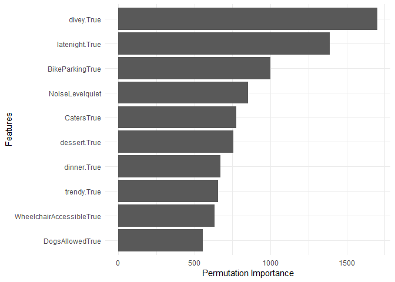
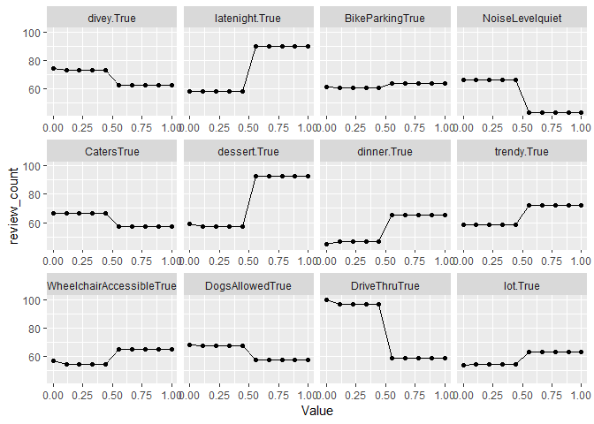
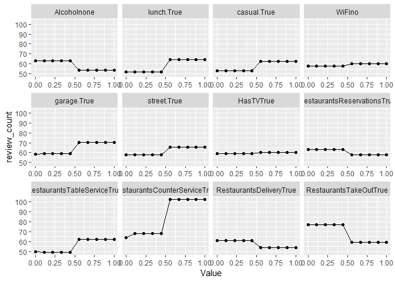
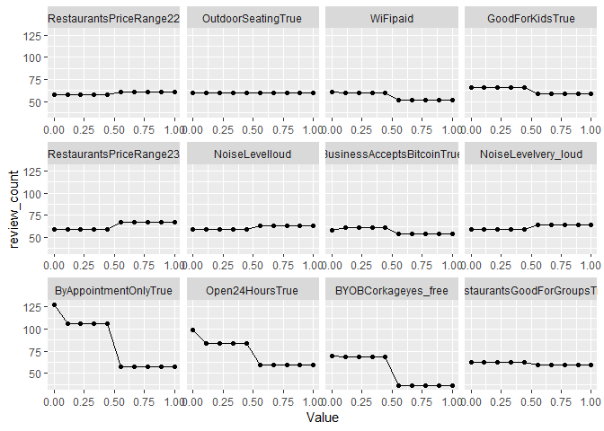
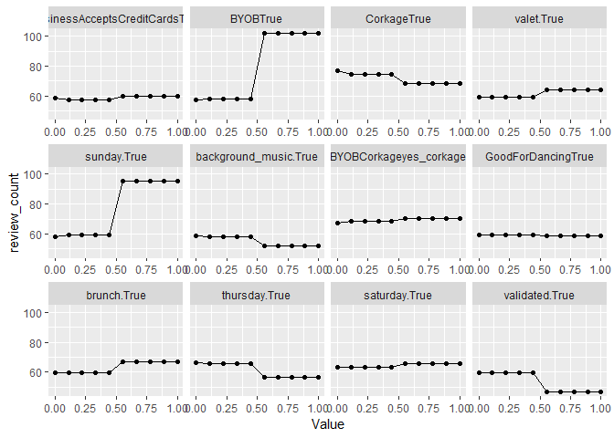
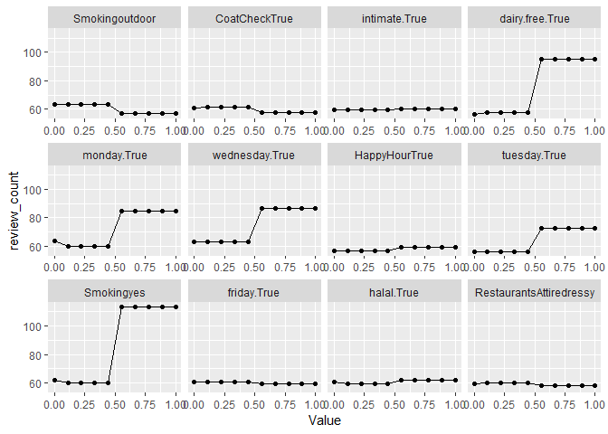
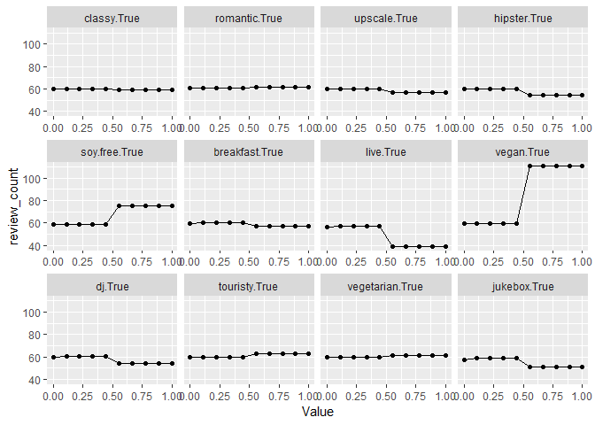
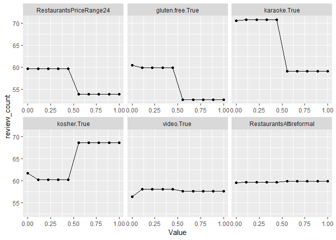

#### Packages

    library(tidyverse)
    library(mlr)
    library(mlrMBO)
    library(parallelMap)
    library(parallel)
    library(data.table)
    library(caret)

Goal of the model
=================

The goal of the model is to predict review counts for Asian restaurants
by the restaurant categories and their attributes and city.

    glimpse(yelp)

    ## Observations: 9,943
    ## Variables: 89
    ## $ business_id                <chr> "hovoWva_UjbnyLWEbnFvBw", "F53MSa5S...
    ## $ name                       <chr> "Thai Gourmet", "Pho Viet", "Firang...
    ## $ neighborhood               <chr> NA, NA, NA, "Harbourfront", NA, "So...
    ## $ address                    <chr> "3732 Darrow Rd Ste 5", "3557 W Dun...
    ## $ city                       <chr> "Stow", "Phoenix", "Brampton", "Tor...
    ## $ state                      <chr> "OH", "AZ", "ON", "ON", "ON", "NV",...
    ## $ postal_code                <chr> "44224", "85051", "L6S", "M5J", "L4...
    ## $ latitude                   <dbl> 41.16571, 33.56705, 43.74261, 43.63...
    ## $ longitude                  <dbl> -81.44137, -112.13614, -79.69876, -...
    ## $ stars                      <dbl> 3.5, 2.5, 4.0, 3.5, 2.0, 3.5, 3.5, ...
    ## $ review_count               <int> 68, 3, 7, 9, 5, 33, 9, 41, 5, 5, 73...
    ## $ is_open                    <int> 1, 0, 1, 0, 1, 1, 0, 1, 0, 0, 1, 1,...
    ## $ attributes                 <list> [<"Alcohol: full_bar", "Ambience: ...
    ## $ categories                 <list> ["Thai", "Vietnamese", "Indian", <...
    ## $ hours                      <list> [<"Monday 11:0-21:30", "Tuesday 11...
    ## $ type                       <chr> "business", "business", "business",...
    ## $ AcceptsInsurance           <chr> NA, NA, NA, NA, NA, NA, NA, NA, NA,...
    ## $ AgesAllowed                <chr> NA, NA, NA, NA, NA, NA, NA, NA, NA,...
    ## $ Alcohol                    <chr> "full_bar", NA, "full_bar", "beer_a...
    ## $ BikeParking                <chr> "True", NA, "False", NA, NA, "True"...
    ## $ BusinessAcceptsBitcoin     <chr> NA, NA, NA, NA, NA, NA, NA, NA, NA,...
    ## $ BusinessAcceptsCreditCards <chr> "True", NA, NA, "True", "True", "Tr...
    ## $ ByAppointmentOnly          <chr> NA, NA, NA, NA, NA, NA, NA, NA, NA,...
    ## $ BYOB                       <chr> NA, NA, NA, NA, NA, NA, NA, NA, NA,...
    ## $ BYOBCorkage                <chr> NA, NA, NA, NA, NA, NA, NA, NA, NA,...
    ## $ Caters                     <chr> NA, NA, "True", NA, NA, "True", NA,...
    ## $ CoatCheck                  <chr> NA, NA, NA, NA, NA, NA, "False", NA...
    ## $ Corkage                    <chr> NA, NA, NA, NA, NA, NA, NA, NA, NA,...
    ## $ DogsAllowed                <chr> NA, NA, "False", NA, NA, NA, NA, NA...
    ## $ DriveThru                  <chr> NA, NA, NA, NA, NA, NA, NA, NA, NA,...
    ## $ GoodForDancing             <chr> NA, NA, NA, NA, NA, NA, "True", NA,...
    ## $ GoodForKids                <chr> "True", NA, "True", "True", "True",...
    ## $ HappyHour                  <chr> NA, NA, NA, NA, NA, NA, "True", NA,...
    ## $ HasTV                      <chr> "False", NA, "True", NA, NA, "True"...
    ## $ NoiseLevel                 <chr> "average", NA, NA, NA, NA, "quiet",...
    ## $ Open24Hours                <chr> NA, NA, NA, NA, NA, NA, NA, NA, NA,...
    ## $ OutdoorSeating             <chr> "False", NA, "False", "False", "Fal...
    ## $ RestaurantsAttire          <chr> "casual", NA, "casual", "casual", N...
    ## $ RestaurantsCounterService  <chr> NA, NA, NA, NA, NA, NA, NA, NA, NA,...
    ## $ RestaurantsDelivery        <chr> "False", NA, "False", "True", "Fals...
    ## $ RestaurantsGoodForGroups   <chr> "True", NA, "True", "True", "True",...
    ## $ RestaurantsPriceRange2     <chr> "2", NA, "3", "2", "3", "2", "1", "...
    ## $ RestaurantsReservations    <chr> "True", NA, "True", "True", "True",...
    ## $ RestaurantsTableService    <chr> "True", NA, "True", "True", "False"...
    ## $ RestaurantsTakeOut         <chr> "True", NA, "True", "True", "True",...
    ## $ Smoking                    <chr> NA, NA, NA, NA, NA, NA, NA, NA, NA,...
    ## $ WheelchairAccessible       <chr> "True", NA, "True", "True", NA, NA,...
    ## $ WiFi                       <chr> "no", NA, "free", NA, "no", "free",...
    ## $ casual                     <chr> " True", NA, " False", NA, " False"...
    ## $ classy                     <chr> " False", NA, " False", NA, " False...
    ## $ divey                      <chr> " False", NA, NA, NA, NA, " False",...
    ## $ hipster                    <chr> " False", NA, " False", NA, " False...
    ## $ intimate                   <chr> " False", NA, " False", NA, " False...
    ## $ romantic                   <chr> " False", NA, " False", NA, " False...
    ## $ touristy                   <chr> " False", NA, " False", NA, " False...
    ## $ trendy                     <chr> " False", NA, " False", NA, " False...
    ## $ upscale                    <chr> " False", NA, " False", NA, " False...
    ## $ background_music           <chr> NA, NA, NA, NA, NA, NA, " False", N...
    ## $ dj                         <chr> NA, NA, NA, NA, NA, NA, " True", NA...
    ## $ jukebox                    <chr> NA, NA, NA, NA, NA, NA, " True", NA...
    ## $ karaoke                    <chr> NA, NA, NA, NA, NA, NA, " True", NA...
    ## $ live                       <chr> NA, NA, NA, NA, NA, NA, " False", N...
    ## $ no_music                   <chr> NA, NA, NA, NA, NA, NA, " False", N...
    ## $ video                      <chr> NA, NA, NA, NA, NA, NA, " False", N...
    ## $ garage                     <chr> " False", NA, " False", " False", N...
    ## $ lot                        <chr> " True", NA, " True", " False", NA,...
    ## $ street                     <chr> " False", NA, " False", " False", N...
    ## $ valet                      <chr> " False", NA, " False", " False", N...
    ## $ validated                  <chr> " False", NA, " False", " False", N...
    ## $ friday                     <chr> NA, NA, NA, NA, NA, NA, NA, NA, NA,...
    ## $ monday                     <chr> NA, NA, NA, NA, NA, NA, NA, NA, NA,...
    ## $ saturday                   <chr> NA, NA, NA, NA, NA, NA, NA, NA, NA,...
    ## $ sunday                     <chr> NA, NA, NA, NA, NA, NA, NA, NA, NA,...
    ## $ thursday                   <chr> NA, NA, NA, NA, NA, NA, NA, NA, NA,...
    ## $ tuesday                    <chr> NA, NA, NA, NA, NA, NA, NA, NA, NA,...
    ## $ wednesday                  <chr> NA, NA, NA, NA, NA, NA, NA, NA, NA,...
    ## $ dairy.free                 <chr> NA, NA, NA, NA, NA, NA, NA, NA, NA,...
    ## $ gluten.free                <chr> NA, NA, NA, NA, NA, NA, NA, NA, NA,...
    ## $ halal                      <chr> NA, NA, NA, NA, NA, NA, NA, NA, NA,...
    ## $ kosher                     <chr> NA, NA, NA, NA, NA, NA, NA, NA, NA,...
    ## $ soy.free                   <chr> NA, NA, NA, NA, NA, NA, NA, NA, NA,...
    ## $ vegan                      <chr> NA, NA, NA, NA, NA, NA, NA, NA, NA,...
    ## $ vegetarian                 <chr> NA, NA, NA, NA, NA, NA, NA, NA, NA,...
    ## $ breakfast                  <chr> " False", NA, NA, " False", NA, " F...
    ## $ brunch                     <chr> " False", NA, NA, " False", NA, " F...
    ## $ dessert                    <chr> " False", NA, NA, " False", NA, " F...
    ## $ dinner                     <chr> " True", NA, NA, " False", NA, " Tr...
    ## $ latenight                  <chr> " False", NA, NA, " False", NA, " F...
    ## $ lunch                      <chr> " True", NA, NA, " False", NA, " Tr...

1 Model Building
================

1.1 Subsetting the the data
---------------------------

Selecting the columns categories and attributes which were built through
data wrangling (leaving out columns with less than two factor levels).

    dat = yelp %>%
      dplyr::select(review_count, Alcohol:lunch, -no_music)

1.2 Preparing the data
----------------------

Making dummy features for all character columns.

    dummy_dat = dummyVars("~ .", data = dat, fullRank = T)

    dat = data.frame(predict(dummy_dat, newdata = dat))

1.3 Building the model
----------------------

Building the model using XGBoost.

    train_task = makeRegrTask(data = dat, target = "review_count")

    xgb = makeLearner("regr.xgboost", 
                      par.vals = list(eta = 0.1))

    ps = makeParamSet(
      makeIntegerParam("nrounds", lower = 1, upper = 500),
      makeIntegerParam("max_depth", lower = 1, upper = 6),
      makeNumericParam("subsample", lower = 0.2, upper = 1),
      makeNumericParam("colsample_bytree", lower = 0.2, upper = 1))

    mbo.ctrl = makeMBOControl()
    mbo.ctrl = setMBOControlTermination(mbo.ctrl, iters = 5)
    ctrl = makeTuneControlMBO(mbo.control = mbo.ctrl)

    rdesc = makeResampleDesc("CV",
                             iters = 5) 

    parallelStartSocket(cpus = detectCores())

    set.seed(3)
    xgb_tune = tuneParams(learner = xgb, 
                          par.set = ps,
                          task = train_task, 
                          resampling = rdesc,
                          control = ctrl, 
                          show.info = FALSE, 
                          measures = rmse)

    parallelStop()

Checking the tuned hyperparameters.

    xgb_tune$x

    ## $nrounds
    ## [1] 271
    ## 
    ## $max_depth
    ## [1] 6
    ## 
    ## $subsample
    ## [1] 0.8777864
    ## 
    ## $colsample_bytree
    ## [1] 0.2001754

1.4 Performance of the model
----------------------------

Checking the performance measures of the final model.

    lrn = setHyperPars(xgb, par.vals = xgb_tune$x)

    parallelStartSocket(cpus = detectCores())

    set.seed(3)
    bmr = benchmark(lrn, train_task, rdesc, measures = list(rmse, rsq))

    parallelStop()

    bmr$results$dat$regr.xgboost$aggr %>%
      knitr::kable("html", col.names = NULL)

<table>
<tbody>
<tr>
<td style="text-align:left;">
rmse.test.rmse
</td>
<td style="text-align:right;">
103.8042181
</td>
</tr>
<tr>
<td style="text-align:left;">
rsq.test.mean
</td>
<td style="text-align:right;">
0.3725633
</td>
</tr>
</tbody>
</table>
1.5 Feature importance
----------------------

Checking the most important features (top 10) for predicting the review
count.

    imp = generateFeatureImportanceData(task = train_task, 
                                        method = "permutation.importance", 
                                        learner = lrn,
                                        nmc = 10)

    imp = melt(imp$res[, 2:ncol(imp$res)]) 

    imp %>% 
      arrange(-value) %>%
      head(10) %>%
      ggplot(aes(x = reorder(variable, value), y = value)) + 
      geom_bar(stat = "identity")  +
      labs(x = "Features", y = "Permutation Importance") +
      coord_flip() +
      theme_minimal()

1.6 Partial Dependencies
------------------------

Checking the partial dependencies of all features.

    mod = mlr::train(lrn, train_task)

    features1 = imp %>%
      arrange(-value) %>%
      slice(1:12)

    pd1 = generatePartialDependenceData(mod, train_task, c(paste(features1$variable)))

    features2 = imp %>%
      arrange(-value) %>%
      slice(13:24)

    pd2 = generatePartialDependenceData(mod, train_task, c(paste(features2$variable)))

    features3 = imp %>%
      arrange(-value) %>%
      slice(25:36)

    pd3 = generatePartialDependenceData(mod, train_task, c(paste(features3$variable)))

    features4 = imp %>%
      arrange(-value) %>%
      slice(37:48)

    pd4 = generatePartialDependenceData(mod, train_task, c(paste(features4$variable)))

    features5 = imp %>%
      arrange(-value) %>%
      slice(49:60)

    pd5 = generatePartialDependenceData(mod, train_task, c(paste(features5$variable)))

    features6 = imp %>%
      arrange(-value) %>%
      slice(61:72)

    pd6 = generatePartialDependenceData(mod, train_task, c(paste(features6$variable)))

    features7 = imp %>%
      arrange(-value) %>%
      slice(73:78)

    pd7 = generatePartialDependenceData(mod, train_task, c(paste(features7$variable)))

    plotPartialDependence(pd1)

    plotPartialDependence(pd2)

    plotPartialDependence(pd3)

    plotPartialDependence(pd4)

    plotPartialDependence(pd5)

    plotPartialDependence(pd6)

    plotPartialDependence(pd7)

2 Conclusion
============

-   The model is able to predict review counts with an RMSE of 104.

-   Overall, 37% of the variance can be explained.

-   The features which are most important for the prediction are
    diveyTrue, dinnerTrue and BikeparkingTrue.

-   In order to get a high review count the restaurant should be take
    the following points into account:
-   Food offers:
    -   Dessert, lunch, brunch, alcohol, dairy-free options, vegan
        options,  
        soy-free options, kosher options.  
-   Non-Food offers:
    -   Smoking area, happy hour, parking options (garage, valet,
        street), wheelchair accessibility, counter service, table
        service, BYOB (for nonalcoholic drinks).
-   Ambiance:
    -   Trendy, casual, good for late night, good for dinner.
