#### Packages

    library(tidyverse)

    glimpse(yelp)

    ## Observations: 9,943
    ## Variables: 89
    ## $ business_id                <chr> "hovoWva_UjbnyLWEbnFvBw", "F53MSa5S...
    ## $ name                       <chr> "Thai Gourmet", "Pho Viet", "Firang...
    ## $ neighborhood               <chr> NA, NA, NA, "Harbourfront", NA, "So...
    ## $ address                    <chr> "3732 Darrow Rd Ste 5", "3557 W Dun...
    ## $ city                       <chr> "Stow", "Phoenix", "Brampton", "Tor...
    ## $ state                      <chr> "OH", "AZ", "ON", "ON", "ON", "NV",...
    ## $ postal_code                <chr> "44224", "85051", "L6S", "M5J", "L4...
    ## $ latitude                   <dbl> 41.16571, 33.56705, 43.74261, 43.63...
    ## $ longitude                  <dbl> -81.44137, -112.13614, -79.69876, -...
    ## $ stars                      <dbl> 3.5, 2.5, 4.0, 3.5, 2.0, 3.5, 3.5, ...
    ## $ review_count               <int> 68, 3, 7, 9, 5, 33, 9, 41, 5, 5, 73...
    ## $ is_open                    <int> 1, 0, 1, 0, 1, 1, 0, 1, 0, 0, 1, 1,...
    ## $ attributes                 <list> [<"Alcohol: full_bar", "Ambience: ...
    ## $ categories                 <list> ["Thai", "Vietnamese", "Indian", <...
    ## $ hours                      <list> [<"Monday 11:0-21:30", "Tuesday 11...
    ## $ type                       <chr> "business", "business", "business",...
    ## $ AcceptsInsurance           <chr> NA, NA, NA, NA, NA, NA, NA, NA, NA,...
    ## $ AgesAllowed                <chr> NA, NA, NA, NA, NA, NA, NA, NA, NA,...
    ## $ Alcohol                    <chr> "full_bar", NA, "full_bar", "beer_a...
    ## $ BikeParking                <chr> "True", NA, "False", NA, NA, "True"...
    ## $ BusinessAcceptsBitcoin     <chr> NA, NA, NA, NA, NA, NA, NA, NA, NA,...
    ## $ BusinessAcceptsCreditCards <chr> "True", NA, NA, "True", "True", "Tr...
    ## $ ByAppointmentOnly          <chr> NA, NA, NA, NA, NA, NA, NA, NA, NA,...
    ## $ BYOB                       <chr> NA, NA, NA, NA, NA, NA, NA, NA, NA,...
    ## $ BYOBCorkage                <chr> NA, NA, NA, NA, NA, NA, NA, NA, NA,...
    ## $ Caters                     <chr> NA, NA, "True", NA, NA, "True", NA,...
    ## $ CoatCheck                  <chr> NA, NA, NA, NA, NA, NA, "False", NA...
    ## $ Corkage                    <chr> NA, NA, NA, NA, NA, NA, NA, NA, NA,...
    ## $ DogsAllowed                <chr> NA, NA, "False", NA, NA, NA, NA, NA...
    ## $ DriveThru                  <chr> NA, NA, NA, NA, NA, NA, NA, NA, NA,...
    ## $ GoodForDancing             <chr> NA, NA, NA, NA, NA, NA, "True", NA,...
    ## $ GoodForKids                <chr> "True", NA, "True", "True", "True",...
    ## $ HappyHour                  <chr> NA, NA, NA, NA, NA, NA, "True", NA,...
    ## $ HasTV                      <chr> "False", NA, "True", NA, NA, "True"...
    ## $ NoiseLevel                 <chr> "average", NA, NA, NA, NA, "quiet",...
    ## $ Open24Hours                <chr> NA, NA, NA, NA, NA, NA, NA, NA, NA,...
    ## $ OutdoorSeating             <chr> "False", NA, "False", "False", "Fal...
    ## $ RestaurantsAttire          <chr> "casual", NA, "casual", "casual", N...
    ## $ RestaurantsCounterService  <chr> NA, NA, NA, NA, NA, NA, NA, NA, NA,...
    ## $ RestaurantsDelivery        <chr> "False", NA, "False", "True", "Fals...
    ## $ RestaurantsGoodForGroups   <chr> "True", NA, "True", "True", "True",...
    ## $ RestaurantsPriceRange2     <chr> "2", NA, "3", "2", "3", "2", "1", "...
    ## $ RestaurantsReservations    <chr> "True", NA, "True", "True", "True",...
    ## $ RestaurantsTableService    <chr> "True", NA, "True", "True", "False"...
    ## $ RestaurantsTakeOut         <chr> "True", NA, "True", "True", "True",...
    ## $ Smoking                    <chr> NA, NA, NA, NA, NA, NA, NA, NA, NA,...
    ## $ WheelchairAccessible       <chr> "True", NA, "True", "True", NA, NA,...
    ## $ WiFi                       <chr> "no", NA, "free", NA, "no", "free",...
    ## $ casual                     <chr> " True", NA, " False", NA, " False"...
    ## $ classy                     <chr> " False", NA, " False", NA, " False...
    ## $ divey                      <chr> " False", NA, NA, NA, NA, " False",...
    ## $ hipster                    <chr> " False", NA, " False", NA, " False...
    ## $ intimate                   <chr> " False", NA, " False", NA, " False...
    ## $ romantic                   <chr> " False", NA, " False", NA, " False...
    ## $ touristy                   <chr> " False", NA, " False", NA, " False...
    ## $ trendy                     <chr> " False", NA, " False", NA, " False...
    ## $ upscale                    <chr> " False", NA, " False", NA, " False...
    ## $ background_music           <chr> NA, NA, NA, NA, NA, NA, " False", N...
    ## $ dj                         <chr> NA, NA, NA, NA, NA, NA, " True", NA...
    ## $ jukebox                    <chr> NA, NA, NA, NA, NA, NA, " True", NA...
    ## $ karaoke                    <chr> NA, NA, NA, NA, NA, NA, " True", NA...
    ## $ live                       <chr> NA, NA, NA, NA, NA, NA, " False", N...
    ## $ no_music                   <chr> NA, NA, NA, NA, NA, NA, " False", N...
    ## $ video                      <chr> NA, NA, NA, NA, NA, NA, " False", N...
    ## $ garage                     <chr> " False", NA, " False", " False", N...
    ## $ lot                        <chr> " True", NA, " True", " False", NA,...
    ## $ street                     <chr> " False", NA, " False", " False", N...
    ## $ valet                      <chr> " False", NA, " False", " False", N...
    ## $ validated                  <chr> " False", NA, " False", " False", N...
    ## $ friday                     <chr> NA, NA, NA, NA, NA, NA, NA, NA, NA,...
    ## $ monday                     <chr> NA, NA, NA, NA, NA, NA, NA, NA, NA,...
    ## $ saturday                   <chr> NA, NA, NA, NA, NA, NA, NA, NA, NA,...
    ## $ sunday                     <chr> NA, NA, NA, NA, NA, NA, NA, NA, NA,...
    ## $ thursday                   <chr> NA, NA, NA, NA, NA, NA, NA, NA, NA,...
    ## $ tuesday                    <chr> NA, NA, NA, NA, NA, NA, NA, NA, NA,...
    ## $ wednesday                  <chr> NA, NA, NA, NA, NA, NA, NA, NA, NA,...
    ## $ dairy.free                 <chr> NA, NA, NA, NA, NA, NA, NA, NA, NA,...
    ## $ gluten.free                <chr> NA, NA, NA, NA, NA, NA, NA, NA, NA,...
    ## $ halal                      <chr> NA, NA, NA, NA, NA, NA, NA, NA, NA,...
    ## $ kosher                     <chr> NA, NA, NA, NA, NA, NA, NA, NA, NA,...
    ## $ soy.free                   <chr> NA, NA, NA, NA, NA, NA, NA, NA, NA,...
    ## $ vegan                      <chr> NA, NA, NA, NA, NA, NA, NA, NA, NA,...
    ## $ vegetarian                 <chr> NA, NA, NA, NA, NA, NA, NA, NA, NA,...
    ## $ breakfast                  <chr> " False", NA, NA, " False", NA, " F...
    ## $ brunch                     <chr> " False", NA, NA, " False", NA, " F...
    ## $ dessert                    <chr> " False", NA, NA, " False", NA, " F...
    ## $ dinner                     <chr> " True", NA, NA, " False", NA, " Tr...
    ## $ latenight                  <chr> " False", NA, NA, " False", NA, " F...
    ## $ lunch                      <chr> " True", NA, NA, " False", NA, " Tr...

Questions of the EDA
====================

Demand:

-   Which categories have the greatest demand (review count)?

-   Where (city,state) is the greatest demand (review counts)?

Popularity:

-   Which categories are most popular (stars)?

-   Which categories with the greatest demand are most popular (stars)?

-   Which categories in which states are most popular (stars)?

-   Which categories in which cities are most popular (stars)?

Competition:

-   Where is the biggest competition (restaurant appearance)?

Success:

-   Exploring the relationship between stars, review count and
    open/closed.

1 Demand
========

1.1 Distribution of Review Counts
---------------------------------

Distribution of review counts and mean review counts.

    mean_review_count = mean(yelp$review_count)

    yelp %>%
      ggplot(aes(x = review_count)) +
      geom_histogram(binwidth = 100, boundary = 0) +
      xlim(0, 1500) +
      geom_vline(aes(xintercept = mean_review_count),
                   linetype="dashed", colour="red", size=1) +
      theme_minimal() 

    ## Warning: Removed 10 rows containing non-finite values (stat_bin).

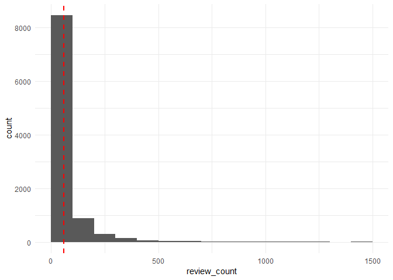

1.2 Demand per category
-----------------------

Number of reviews per category.

    yelp %>%
      unnest(categories) %>%
      group_by(categories) %>%
      summarise(sum_review_count =  sum(review_count)) %>%
      ggplot(aes(x = reorder(categories, sum_review_count), y = sum_review_count)) +
      geom_bar(stat = "identity") +
      labs(x = "categories", y = "review count") +
      coord_flip() +
      theme_minimal()

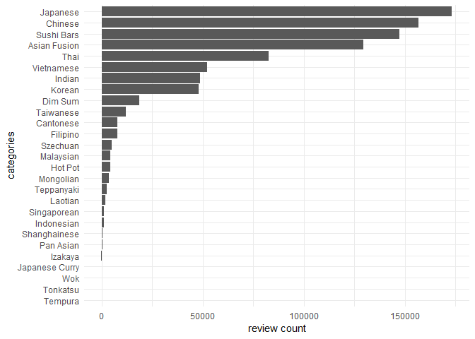

1.3 Demand per state
--------------------

Number of reviews per category per state (Top 5).

    yelp %>%
      unnest(categories) %>%
      group_by(state, categories) %>%
      summarise(review_count = sum(review_count)) %>%
      top_n(5, review_count) %>%
      ggplot(aes(x = reorder(state, review_count), 
                 y = review_count, 
                 fill = categories)) +
      scale_fill_brewer(palette = "Paired") +
      labs(x = "state", y = "review count") +
      geom_bar(stat = "identity") +
      coord_flip() +
      theme_minimal()

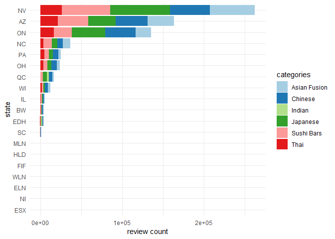

1.4 Demand per city
-------------------

Number of review counts per category (Top 5) in the cities with the most
review counts (Top 10).

    cities = yelp %>%
      group_by(city) %>%
      summarise(n = sum(review_count)) %>%
      arrange(-n) %>%
      head(10)

    yelp %>%
      filter(city %in% cities$city) %>%
      unnest(categories) %>%
      group_by(city, categories) %>%
      summarise(review_count = sum(review_count)) %>%
      top_n(5, review_count) %>%
      ggplot(aes(x = reorder(city, review_count), 
                 y = review_count, fill = categories)) +
      geom_bar(stat = "identity") +
      scale_fill_brewer(palette = "Paired") +
      labs(x = "city", y = "review count") +
      coord_flip() +
      theme_minimal()

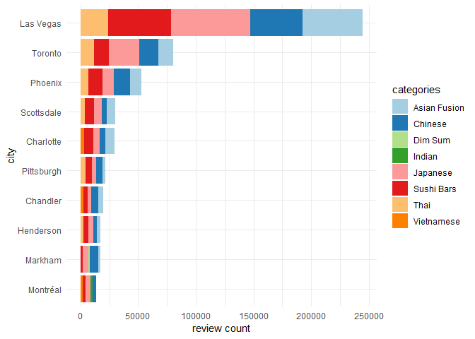

2 Popularity
============

2.1 Distribution of stars
-------------------------

Distribution of stars and the mean of stars.

    mean_stars = mean(yelp$stars)

    yelp %>%
      count(stars) %>%
      ggplot(aes(x = stars, y = n)) +
      geom_bar(stat = "identity") +
      geom_vline(aes(xintercept = mean_stars),
                   linetype="dashed", colour="red", size=1) +
      theme_minimal()

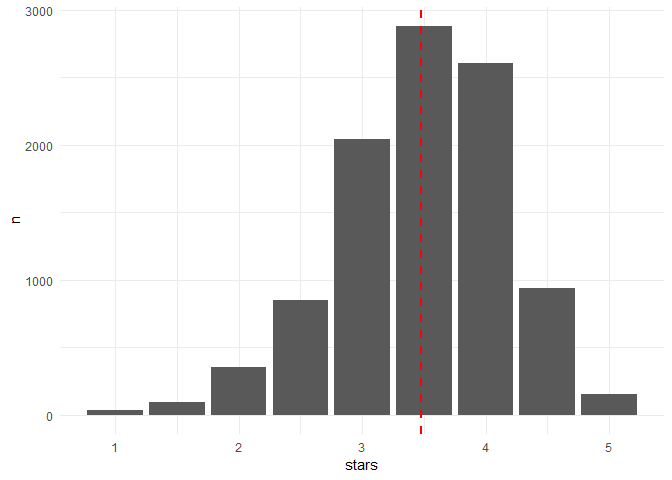

2.2 Stars per category
----------------------

Distribution of stars per category.

    rc = yelp %>%
      unnest(categories) %>%
      group_by(categories) %>%
      summarise(review_count = sum(review_count))

    rc2 = yelp %>%
        unnest(categories) %>%
        group_by(categories, stars) %>%
        summarise(review_count = sum(review_count))

    merge(rc, rc2, by = "categories") %>%
      ggplot(aes(x = reorder(categories, review_count.y), y = review_count.y, fill = as.factor(stars))) +
      geom_bar(stat = "identity") +
      scale_fill_brewer(palette = "Paired") +
      labs(x = "categories", y = "review count", fill = "stars") +
      coord_flip() +
      theme_minimal()

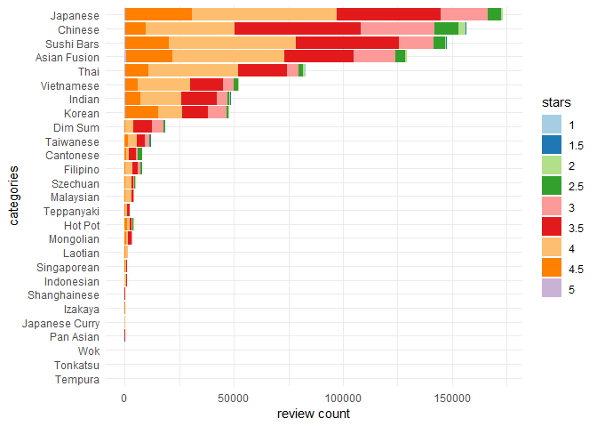

2.3 Mean of stars per state
---------------------------

Mean of stars in the states with the most review counts (Top 5) per
category (Top 5).

    yelp %>%
      filter(state %in% c("NV", "AZ", "ON", "NC", "PA")) %>%
      unnest(categories) %>%
      filter(categories %in% c("Asian Fusion", "Japanese", "Chinese", "Thai", "Sushi Bars")) %>%
      group_by(state, categories) %>%
      summarise(mean_stars = mean(stars)) %>%
      ggplot(aes(y = mean_stars, 
                 x = reorder(state, mean_stars), 
                 fill = categories)) +
      geom_bar(stat = "identity", position = "dodge") +
      scale_fill_brewer(palette = "Paired") +
      labs(x = "state", y = "mean stars", fill = "categories") +
      theme_minimal() +
      coord_flip()

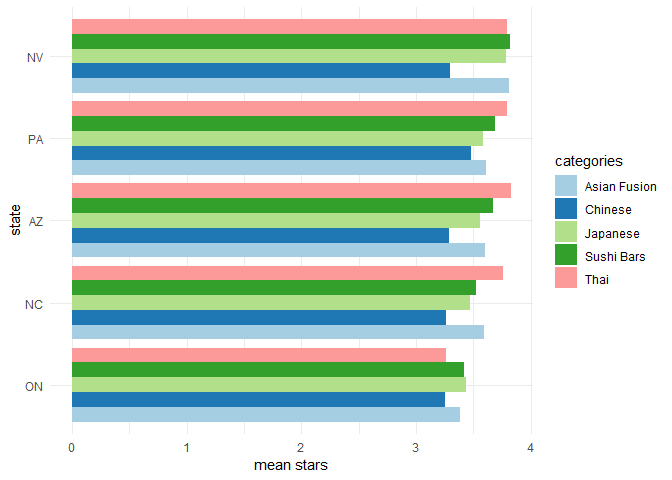

2.4 Mean stars per city
-----------------------

Mean of stars in the cities with the most review counts (top 10) per
category (top 5).

    yelp %>%
      filter(city %in% c(cities$city)) %>%
      unnest(categories) %>%
      filter(categories %in% c("Japanese", "Chinese", "Asian Fusion", "Sushi Bars",
                               "Thai")) %>%
      group_by(city, categories) %>%
      summarise(mean_stars = mean(stars)) %>%
      ggplot(aes(x = reorder(city, mean_stars), 
                 y = mean_stars, 
                 fill = categories)) +
      geom_bar(stat = "identity", position = "dodge") +
      scale_fill_brewer(palette = "Paired") +
      labs(x = "categories", y = "mean stars", fill = "categories") +
      coord_flip() +
      theme_minimal()

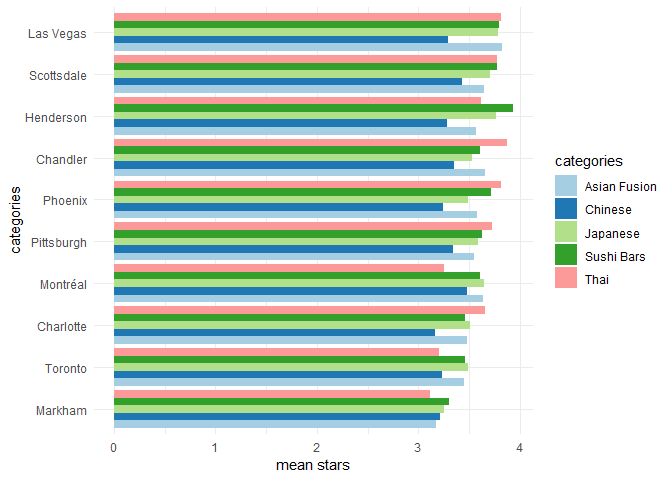

3 Competition
=============

3.1 Number of restaurants
-------------------------

Number of restaurants per category.

    yelp %>%
      unnest(categories) %>%
      count(categories) %>%
      ggplot(aes(reorder(categories, n), n)) +
      geom_bar(stat = "identity") +
      labs(x = "categories", y = "n") +
      theme_minimal() +
      coord_flip()

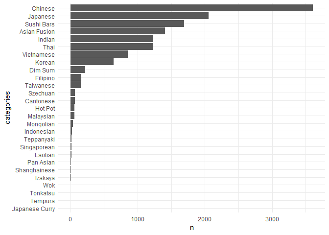

3.2 Competition per state
-------------------------

Number of restaurants (Top 5) per state.

    yelp %>%
      unnest(categories) %>%
      group_by(state) %>%
      count(categories) %>%
      top_n(5, n) %>%
      ggplot(aes(x = reorder(state, n), y = n, fill = categories)) +
      geom_bar(stat = "identity", position = "stack") +
      scale_fill_brewer(palette = "Paired") +
      labs(x = "state") +
      theme_minimal() +
      coord_flip()

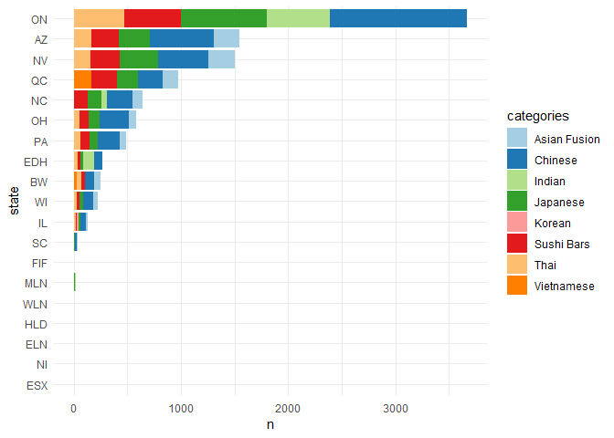

3.3 Number of restaurants per city
----------------------------------

Number of restaurants per city (Top 10) per category (Top 5).

    yelp %>%
      filter(city %in% cities$city) %>%
      unnest(categories) %>%
      group_by(city) %>%
      count(categories) %>%
      top_n(5, n) %>%
      ggplot(aes(x = reorder(city, n), y = n, fill = categories)) +
      geom_bar(stat = "identity", position = "stack") +
      scale_fill_brewer(palette = "Paired") +
      labs(x = "state") +
      theme_minimal() +
      coord_flip()

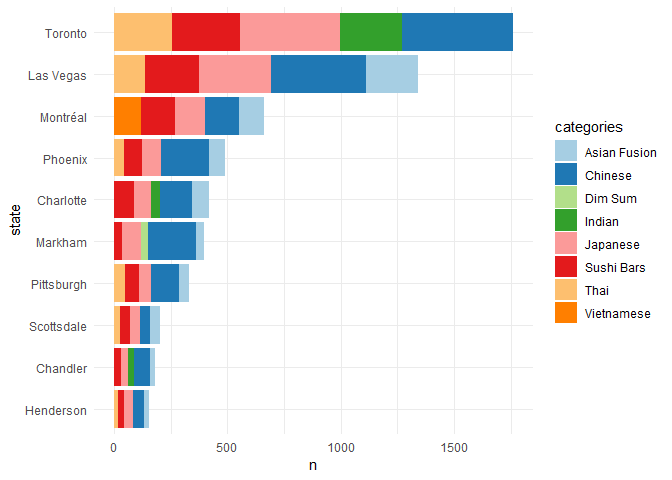

4 Success
=========

4.1 Relationship between open/closed and review count
-----------------------------------------------------

Logistic regression between is open and review count.

    yelp %>%
      ggplot(aes(x = review_count, y = is_open)) +
      stat_smooth(method = "glm", method.args=list(family="binomial")) +
      scale_x_continuous(limits = c(0, 1500)) +
      theme_minimal()

    ## Warning: Removed 10 rows containing non-finite values (stat_smooth).

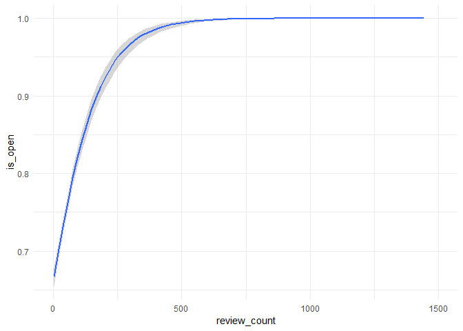

4.2 Relationship between open/closed and stars
----------------------------------------------

Logistic regression between is open and stars.

    yelp %>%
      ggplot(aes(x = stars, y = is_open)) +
      stat_smooth(method = "glm", method.args=list(family="binomial")) +
      theme_minimal()

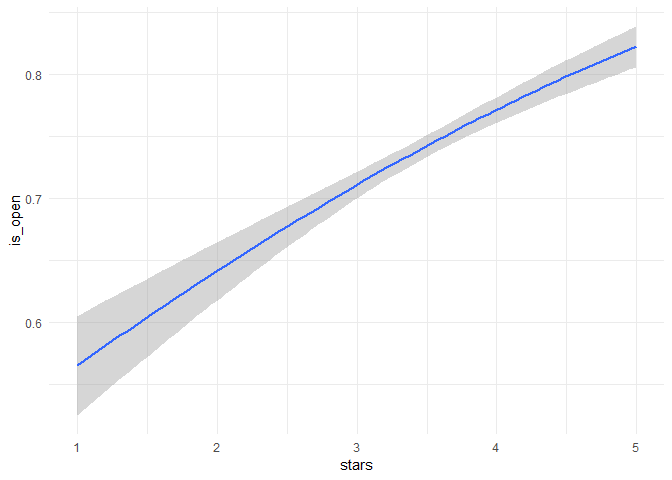

4.3 Relationship between stars and review count
-----------------------------------------------

Smoothened linear regression between stars and review count.

    yelp %>%
      ggplot(aes(x = stars , y = review_count)) +
      geom_point() +
      geom_smooth(method = "loess") +
      theme_minimal()

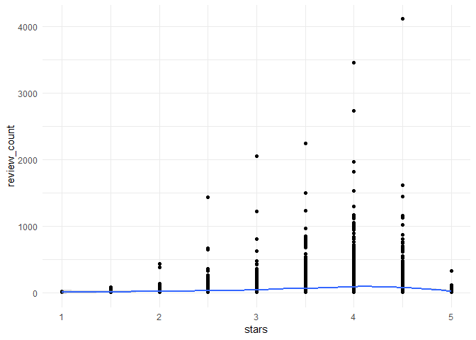

5 Conclusion
============

Demand:

-   Overall, the greatest demand has the Japanese category.

-   The greatest demand is in Las Vegas (NV) for the Japanese category.

Popularity:

-   Overall, the Japanese category is most popular.

-   In NV the most popular category is Shushi Bars.

-   In Las Vegas the most popular category is Asian Fusion.

Competition:

-   Most of the restaurants are Chinese.

-   The most restaurants are in Toronto (ON).

Success:

-   Stars and review count are a predictor that a busines survives,
    where review count is more important.

-   There is a strong relationship betweeen stars and review count but
    only until 4 stars.
